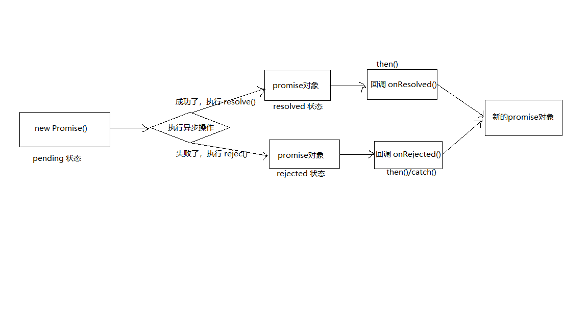

# 第1章 准备
## 1.1 区别实例对象与函数对象
1. 实例对象：`new` 函数产生的对象，称为实例对象，简称为对象
2. 函数对象：将函数作为对象使用，简称函数对象
```javascript
function Fn() { // Fn 函数
}
const fn = new Fn() // Fn 是构造函数 fn是实例对象(对象)
console.log(Fn.prototype) // Fn 是函数对象
Fn.bind({}) // Fn 是函数对象
$('#test') // $ 是函数
$.get('/test') // $ 是函数对象
```
## 1.2 二种类型的回调函数
### 1.2.1 同步回调
1. 理解：立即执行，完全执行完了才结束，不会放入会掉队列中
2. 例子：数组遍历相关的回调函数 / `Promise` 的 `excutor` 函数
### 1.2.2 异步回调
1. 理解：不会立即执行，会放入回调队列中将来执行
2. 例子：定时器回调 / `ajax` 回调 / `Promise` 的成功|失败的回调 
```javascript
// 1. 同步回调函数
const arr = [1, 3, 5]
arr.forEach(item => { // 遍历回调，每取出一个元素调用一次  同步回调函数，不会放到队列，一上来就要执行完
  console.log(item)
})
console.log('forEach()之后')
/*控制台打印信息：
    1
    3
    5
    forEach()之后
*/
// 2. 异步回调函数
setTimeout(()=>{ // 异步回调函数,会放到队列中将来执行
  console.log("timeout callback()")
}, 0)
console.log("setTimeout之后")
/*控制台打印信息：
    setTimeout之后
    timeout callback()
*/
```
## 1.3 JS 的 error 处理
* 目标：进一步理解JS中的错误(Error)和错误处理
    + mdn文档：https://developer.mozilla.org/zh-CN/docs/Web/JavaScript/Reference/Global_Objects/Error
1. 错误的类型
    + `Error`：所有错误的父类型
    + `ReferenceError`：引用的变量不存在
        ```javascript
        console.log(a) // Uncaught ReferenceError: a is not defined
        ```
    + `TypeError`：数据类型不正确的错误
        ```javascript
        let b = null
        console.log(b.xxx) // Uncaught TypeError: Cannot read property 'xxx' of null
        ```
    + `RangeError`：数据值不在其允许的范围内
        ```javascript
          function fn() {
            fn()
          }
          fn() // Uncaught RangeError: Maximum call stack size exceeded
        ```
    + `SyntaxError`：语法错误
        ```javascript
        const c = """" // Uncaught SyntaxError: Unexpected string
        ```
2. 错误处理
    + 捕获错误： `try .. catch`
        ```javascript
        try {
          let d
          console.log(d.xxx)
        } catch (err) {
          console.log(err) // TypeError: Cannot read property 'xxx' of undefined
          // console.log(err.message)
          // console.log(err.stack)
        }
        console.log("出错之后")
        /*
          TypeError: Cannot read property 'xxx' of undefined
            at 03_准备_error.html?_ijt=k9vcnjofj3tsmvai7hl2lctrk5:47
          出错之后
         */
        ```
    + 抛出错误： `throw error`
        ```javascript
        function someThing() {
          if (Date.now() % 2 === 1) {
            console.log("当前时间为奇数，可以执行任务")
          } else { // 如果时间为偶数，由调用者处理
            throw new Error("当前时间为偶数，无法执行任务")
          }
        }
        try {
          someThing()
        } catch (error) {
          alert(error.message)
        }
        ```
3. 错误对象
    + `message`属性：错误相关信息
    + `stack`属性：函数调用栈记录信息
# 第2章 promise 的理解和使用
## 2.1 Promise 是什么？
### 2.1.1 理解
1. 抽象表达：
    + `Promise` 是异步编程的新的解决方案（旧的是谁？）
2. 具体表达：
    + 从语法上来说： `Promise` 是一个构造函数
    + 从功能上来说： `Promise` 对象用来封装一个异步操作并可以获取其结果
### 2.1.2 promise 的状态改变
1. `pending` 变为 `resolved`
2. `pending` 变为 `rejected`
* 说明：只有这2种，切一个 `promise` 对象只能改变一次
    + 无论是成功还是失败，都会有一个结果数据
    + 成功的结果数据一般称为 `value`，失败的结果数据一般称为 `reason`
### 2.1.3 promise 的基本流程

### 2.1.4 promise 的基本使用
```javascript
// 1. 创建一个新的 promise
const p = new Promise((resolve, reject) => { // 执行器函数
  // 2. 执行异步操作任务
  setTimeout(()=> {
    const time = Date.now() // 如果当前时间是偶数就代表成功，否则代表失败
    if(time % 2 === 0) { // 3.1 如果成功了，调用 resolve(value)
      resolve("成功的数据，time=" + time)
    } else { // 3.2 如果失败了，调用 reject(reason)
      reject("失败的数据，time=" + time)
    }
  })
}).then(value => { // 接收得到成功的 value 数据  onResolved
  console.log("成功的回调 ", value)
}, reason => { // 接收得到的失败的 reason 数据  onRejected
  console.log("失败的回调 ", reason)
})
/*
    成功的回调  成功的数据，time=1604644474094
    或
    失败的回调  失败的数据，time=1604644507259
*/
```
## 2.2 为什么要用 Promise？
### 2.2.1 指定回调函数的方式更加灵活
1. 旧的：必须在启动异步任务前指定（先指定回调函数，再启动异步任务）
2. `promise`：启动异步任务 => 返回 `promise` 对象 => 给 `promise` 对象绑定回调函数（甚至可以在异步任务结束后指定/多个）
### 2.2.2 支持链式调用，可以解决回调地狱问题
1. 什么是回调地狱？
    * 回调函数嵌套调用，外部回调函数异步执行的结果是其内部嵌套的回调函数执行的条件
    ```javascript
    doSomething(function(result) {
      doSomethingElse(result, function(newResult) {
        doThirdThing(newResult, function(finalResult) {
          console.log('Got the final result:' + finalResult)
        }, failureCallback)
      }, failureCallback)
    }, failureCallback)
    ```
2. 回调地狱的缺点？
    * 不便于阅读
    * 不便于异常处理
3. 解决方案
    * `promise` 链式调用
    ```javascript
    doSomething()
      .then(result => doSomethingElse(result))
      .then(newResult => doThirdThing(newResult))
      .then(finalResult => {
         console.log('Got the final result:' + finalResult)
      })
      .catch(failureCallback)
    ```
4. 终极解决方案
    * `async` / `await`
    ```javascript
    async function request() {
      try{
        const result = await doSomething()
        const newResult = await doSomethingElse(result)
        const finalResult = await doThirdThing(newResult)
        console.log('Got the final result:' + finalResult)
      } catch (error) {
        failureCallback(error)
      }
    }
    ```
## 2.3 如何使用 Promise？
### 2.3.1 API
1. `Promise` 构造函数： `Promise(excutor) {}`
    * `excutor` 函数：同步执行 `(resolve, reject) => {}`
    * `resolve` 函数：内部定义成功时我们调用的函数 `value => {}`
    * `reject` 函数：内部定义失败时我们调用的函数 `reason => {}`
    * 说明：`excutor` 会在 `Promise` 内部立即同步回调，异步操作在执行器中执行
2. `Promise.prototype.then` 方法： `(onResolved, onRejected) => {}`
    * `onResolved` 函数：成功的回调函数 `value => {}`
    * `onRejected` 函数：失败的回调函数 `reason => {}`
    * 说明：指定用于得到成功 `value` 的成功回调和用于得到失败 `reason` 失败回调，返回一个新的 `Promise` 对象
3. `Promise.prototype.catch` 方法： `p.catch(onRejected)`
    * `onRejected` 函数：失败的回调函数 `reason => {}`
    * 说明：`then()` 的语法糖，相当于 `then(undefined, onRejected)`
```javascript
new Promise((resolve, reject)=>{
  setTimeout(()=>{
    resolve("成功的数据")
    // reject("失败的数据")
  }, 1000)
}).then(
    value => {
      console.log("onResolved()1", value)
    }
).catch(
    reason => {
      console.log("onRejected()1", reason)
    }
)
```
4. `Promise.resolve` 方法：`value => {}`
    * `value`： 成功的数据或`promise`对象
    * 说明：返回一个成功/失败的 `promise` 对象
5. `Promise.reject` 方法：`reason => {}`
    * `reason`： 失败的原因
    * 说明：返回一个失败的 `promise` 对象
```javascript
// 产生一个成功值为1 的promise对象
const p1 = new Promise((resolve, reject)=>{
  resolve(1)
})
const p2 = Promise.resolve(2) // 语法糖
const p3 = Promise.reject(3)
p1.then(value => { console.log(value) })
p2.then(value => { console.log(value) })
p3.then(null, reason => { console.log(reason) })
p3.catch(reason => { console.log(reason) })
```
6. `Promise.all` 方法：`promises => {}`
    * `promises`：包含n个 `promise` 的数组
    * 说明：返回一个新的 `promise`，只有所有的 `promise` 都成功才成功，只要有一个失败了就直接失败
7. `Promise.race` 方法： `promises => {}`
    * `promises`：包含n个 `promise` 的数组
    * 说明：返回一个新的 `promise`，第一个完成的 `promise` 的结果状态就是最终的结果状态
```javascript
// 产生一个成功值为1 的promise对象
const p1 = new Promise((resolve, reject)=>{
  resolve(1)
})
const p1_1 = new Promise((resolve, reject)=>{
  setTimeout(()=>{
    resolve(1)
  }, 100)
})
const p2 = Promise.resolve(2) // 语法糖
const p3 = Promise.reject(3)
p1.then(value => { console.log(value) })
p2.then(value => { console.log(value) })
p3.then(null, reason => { console.log(reason) })
p3.catch(reason => { console.log(reason) })

const pAll = Promise.all([p1, p2, p3])
pAll.then(
  value => { console.log("all onResolved()", value) },
  reason => { console.log("all onRejected()", reason) } //all onRejected() 3
)
const pAll2 = Promise.all([p1, p2])
pAll2.then(
    values => { console.log("all onResolved()", values) }, // all onResloved() [1, 2]
    reason => { console.log("all onRejected()", reason) }
)

const pRace = Promise.race([p1, p2, p3])
pRace.then(
    value => { console.log("all onResolved()", value) }, // all onResolved() 1
    reason => { console.log("all onRejected()", reason) }
)
const pRace1 = Promise.race([p1_1, p2, p3])
pRace1.then(
    value => { console.log("all onResolved()", value) }, // all onResolved() 2
    reason => { console.log("all onRejected()", reason) }
)
const pRace2 = Promise.race([p3, p1, p2])
pRace2.then(
    value => { console.log("all onResolved()", value) },
    reason => { console.log("all onRejected()", reason) } // all onRejected() 3
)
```
### 2.3.2 promise的几个关键问题
1. 如何改变 `promise` 状态？
    * `resolve(value)`：如果当前是 `pending` 就会变成 `resolved`
    * `rejected(reason)`：如果当前是 `pending` 就会变成 `rejected`
    * 抛出异常：如果当前是 `pending` 就会变成 `rejected`
    ```javascript
    const p = new Promise((resolve, reject) => {
      // resolve(1) // promise 变为 resolved 成功状态
      // reject(2) // promise 变为 rejected 成功状态
      throw new Error("出错了") // 抛出异常，promise 变为 rejected 成功状态，reason为抛出的error
    })
    p.then(
      value => {
        console.log("value", value)
      },
      reason => {
        console.log("reason", reason)
        /*
          reason Error: 出错了
            at 04_promise的几个关键问题.html?_ijt=sumrlanirspdi97b31m1rurrfl:21
            at new Promise (<anonymous>)
            at 04_promise的几个关键问题.html?_ijt=sumrlanirspdi97b31m1rurrfl:18
         */
      }
    )
    ```
2. 一个 `promise` 指定多个成功/失败回调函数，都会调用吗？
    * 当 `promise` 改变为对应状态时都会调用 
    ```javascript
    const p = new Promise((resolve, reject) => {
      // resolve(1) // promise 变为 resolved 成功状态
      // reject(2) // promise 变为 rejected 成功状态
      throw new Error("出错了") // 抛出异常，promise 变为 rejected 成功状态，reason为抛出的error
    })
    p.then(
      value => {
        console.log("value", value)
      },
      reason => {
        console.log("reason", reason)
      }
    )
    p.then(
        value => {
          console.log("value", value)
        },
        reason => {
          console.log("reason2", reason)
        }
    )
      /*
          reason Error: 出错了
            at 04_promise的几个关键问题.html?_ijt=sumrlanirspdi97b31m1rurrfl:21
            at new Promise (<anonymous>)
            at 04_promise的几个关键问题.html?_ijt=sumrlanirspdi97b31m1rurrfl:18
              04_promise的几个关键问题.html?_ijt=sumrlanirspdi97b31m1rurrfl:36
          reason2 Error: 出错了
            at 04_promise的几个关键问题.html?_ijt=sumrlanirspdi97b31m1rurrfl:21
            at new Promise (<anonymous>)
            at 04_promise的几个关键问题.html?_ijt=sumrlanirspdi97b31m1rurrfl:18
       */
    ```
3. 改变 `promise` 状态和指定回调函数谁先谁后？
    * 都有可能，正常情况下是先指定回调再改变状态，但也可以先改状态再指定回调
        ```javascript
        new Promise(((resolve, reject) => {
          setTimeout(()=>{
            resolve(1) // 后改变的状态（同时指定数据），异步执行回调函数
          }, 1000)
        })).then( // 先指定回调函数，保存当前指定的回调函数
          value => {},
          reason => {}
        )
        ```
    * 如何先改状态再指定回调？
      + 在执行器中直接调用 `resolve()/reject()`
      + 延迟更长时间才调用 `then()`
      ```javascript
        new Promise(((resolve, reject) => {
          resolve(1) // 先改变的状态（同时指定数据）
        })).then( // 后指定回调函数，异步执行回调函数
          value => {},
          reason => {}
        )
      
        const p = new Promise(((resolve, reject) => {
          setTimeout(()=>{
            resolve(1)
          }, 1000)
        }))
        setTimeout(()=>{
          p.then(
            value => {},
            reason => {}
          )
        }, 1100)
        ```
    * 什么时候才能得到数据？
      + 如果先指定回调，那当状态发生改变时，回调函数就会调用，得到数据
      + 如果先改变状态，那当指定回调时，回调函数就会调用，得到数据    
4. `promise.then()` 返回的新 `promise` 的结果状态由什么决定？
    * 简单表达：由 `then()` 指定的回调函数执行的结果决定
    * 详细表达：
      + 如果抛出异常，新 `promise` 变为 `rejected` ， `reason` 为抛出的异常
      + 如果返回的是非 `promise` 的任意值，新`promise` 变为`resolved`，`value` 为返回的值
      + 如果返回的是另一个新的 `promise`，此`promise` 的结果就会成为新的 `promise` 的结果
    ```javascript
    new Promise((resolve, reject) => {
      resolve(1)
    }).then(
      value => {
        console.log('onResolved1()', value) // onResolved1() 1
      },
      reason => {
        console.log('onRejected1()', reason)
      }
    ).then(
      value => {
        console.log('onResolved2()', value) // onResolved2() undefined
      },
      reason => {
        console.log('onRejected2()', reason)
      }
    )
    
    new Promise((resolve, reject) => {
      resolve(1)
    }).then(
        value => {
          console.log('onResolved1()', value) // onResolved1() 1
          return 2
        },
        reason => {
          console.log('onRejected1()', reason)
        }
    ).then(
        value => {
          console.log('onResolved2()', value) // onResolved2() 2
        },
        reason => {
          console.log('onRejected2()', reason)
        }
    )
    
    new Promise((resolve, reject) => {
      resolve(1)
    }).then(
        value => {
          console.log('onResolved1()', value) // onResolved1() 1
          return Promise.resolve(3)
        },
        reason => {
          console.log('onRejected1()', reason)
        }
    ).then(
        value => {
          console.log('onResolved2()', value) // onResolved2() 3
        },
        reason => {
          console.log('onRejected2()', reason)
        }
    )
    
    new Promise((resolve, reject) => {
      resolve(1)
    }).then(
        value => {
          console.log('onResolved1()', value) // onResolved1() 1
          return Promise.reject(4)
        },
        reason => {
          console.log('onRejected1()', reason)
        }
    ).then(
        value => {
          console.log('onResolved2()', value)
        },
        reason => {
          console.log('onRejected2()', reason) // onRejected2() 4
        }
    )
    
    new Promise((resolve, reject) => {
      resolve(1)
    }).then(
        value => {
          console.log('onResolved1()', value) // onResolved1() 1
          throw 5
        },
        reason => {
          console.log('onRejected1()', reason)
        }
    ).then(
        value => {
          console.log('onResolved2()', value)
        },
        reason => {
          console.log('onRejected2()', reason) // onRejected2() 5
        }
    )
    
    new Promise((resolve, reject) => {
      reject(1)
    }).then(
       value => {
         console.log('onResolved1()', value)
       },
       reason => {
         console.log('onRejected1()', reason) // onRejected1() 1
       }
    ).then(
        value => {
          console.log('onResolved2()', value) // onResolved2() undefined
        },
        reason => {
          console.log('onRejected2()', reason)
        }
    )
    ```
5. `promise` 如何串联多个操作任务？
    + `promise` 的 `then()` 返回一个新的 `promise`，可以看成 `then()` 的链式调用
    + 通过 `then()` 的链式调用串联多个同步/异步任务
    ```javascript
    new Promise((resolve, reject) => {
      setTimeout(()=>{
        console.log("执行异步任务1（异步）")
        resolve(1)
      }, 1000)
    }).then(
      value => {
        console.log("任务1的结果：", value)
        console.log("执行任务2（同步）")
        return 2
      }
    ).then(
      value => {
        console.log('任务2的结果：', value)
        return new Promise((resolve, reject)=>{
          // 启动任务3（异步）
          setTimeout(()=>{
            console.log("执行任务3（异步）")
            resolve(3)
          }, 1000)
        })
      }
    ).then(
      value => {
        console.log("任务3的结果：", value)
      }
    )
    ```
6. `promise` 异常穿透？
    + 当使用 `promise` 的 `then` 链式调用时，可以在最后指定失败的回调
    + 前面的操作出了异常，都会传到最后失败的回调中处理
    ```javascript
    new Promise((resolve, reject) => {
      // resolve(1)
      reject(1)
    }).then(
      value => {
        console.log("onResolved1()：", value)
        return 2
      }
    ).then(
      value => {
        console.log("onResolved2()：", value)
        return 3
      }
    ).then(
      value => {
        console.log("onResolved3()：", value)
      }
    ).catch(reason => {
      console.log("onRejected()", reason)
    })
   ```
   + 上述写法实际上是做了如下实现：
   ```javascript
    new Promise((resolve, reject) => {
      // resolve(1)
      reject(1)
    }).then(
      value => {
        console.log("onResolved1()：", value)
        return 2
      },
      reason => { throw reason } // 或 Promise.reject(reason)
    ).then(
      value => {
        console.log("onResolved2()：", value)
        return 3
      },
      reason => { throw reason } // 或 Promise.reject(reason)
    ).then(
      value => {
        console.log("onResolved3()：", value)
      },
      reason => { throw reason } // 或 Promise.reject(reason)
    ).catch(reason => {
      console.log("onRejected()", reason)
    })
    ```
7. 中断 `promise` 链？
    + 当使用 `promise` 的 `then` 链式调用时，在中间中断，不再调用后面的回调函数
    + 办法：在回调函数中返回一个 `pending` 状态的 `promise` 对象
    ```javascript
    new Promise((resolve, reject) => {
      // resolve(1)
      reject(1)
    }).then(
      value => {
        console.log("onResolved1()：", value)
        return 2
      },
      reason => { throw reason }
    ).then(
      value => {
        console.log("onResolved2()：", value)
        return 3
      },
      reason => { throw reason }
    ).then(
      value => {
        console.log("onResolved3()：", value)
      },
      reason => { throw reason }
    ).catch(reason => {
      console.log("onRejected()", reason)
    }).then(
      value => {
        console.log("onResolved4()：", value) // onResolved4()： undefined
      },
      reason => {
        console.log("onRejected2()：", reason)
      }
    )
    ```
   ```javascript
   new Promise((resolve, reject) => {
     // resolve(1)
     reject(1)
   }).then(
     value => {
       console.log("onResolved1()：", value)
       return 2
     },
     reason => { throw reason }
   ).then(
     value => {
       console.log("onResolved2()：", value)
       return 3
     },
     reason => { throw reason }
   ).then(
     value => {
       console.log("onResolved3()：", value)
     },
     reason => { throw reason }
   ).catch(reason => {
     console.log("onRejected()", reason)
     // throw reason
     return Promise.reject(reason)
   }).then(
     value => {
       console.log("onResolved4()：", value)
     },
     reason => {
       console.log("onRejected2()：", reason) // onRejected2()： 1
     }
   )
   ```
   + 中断 `promise` 链
   ```javascript
    new Promise((resolve, reject) => {
      // resolve(1)
      reject(1)
    }).then(
      value => {
        console.log("onResolved1()：", value)
        return 2
      },
      reason => { throw reason }
    ).then(
      value => {
        console.log("onResolved2()：", value)
        return 3
      },
      reason => { throw reason }
    ).then(
      value => {
        console.log("onResolved3()：", value)
      },
      reason => { throw reason }
    ).catch(reason => {
      console.log("onRejected()", reason)
      // throw reason
      // return Promise.reject(reason)
      return new Promise(()=>{}) // 返回一个 pending 的 promise  中断 promise 链
    }).then(
      value => {
        console.log("onResolved4()：", value)
      },
      reason => {
        console.log("onRejected2()：", reason)
      }
    )
    ```    
# 第3章 自定义(手写)Promise
## 3.1 定义整体结构
```javascript
/*
  自定义 Promise 函数模块
*/
// IIFE 立即执行匿名函数自调用
(function (params) {
  const PENDING = "pending"
  const RESOLVED = "resolved"
  const REJECTED = "rejected"
  /**
   * Promise 构造函数
   * @param excutor 执行器函数（同步执行）
   * @constructor
   */
  function Promise(excutor) {

  }
  /*
    Promise 原型对象的 then()
    指定成功和失败的回调函数
    返回一个新的 promise 对象
   */
  Promise.prototype.then = function (onResolved, onRejected) {

  }
  /*
    Promise 原型对象的 catch()
    指定失败的回调函数
    返回一个新的 promise 对象
   */
  Promise.prototype.catch = function (onRejected) {

  }
  /*
    Promise 函数对象 resolve 方法
    返回一个指定结果的成功的promise
   */
  Promise.resolve = function(value) {

  }
  /*
    Promise 函数对象 reject 方法
    返回一个指定reason的失败的promise
   */
  Promise.reject = function(reason) {

  }
  /*
    Promise 函数对象 all 方法
    返回一个promise，只有当所有 promise 都成功时才成功，否则只要有一个失败的就失败
   */
  Promise.all = function(promises) {

  }
  /*
    Promise 函数对象 race 方法
    返回一个promise，其结果由第1个完成的promise决定
   */
  Promise.race = function(promises) {

  }

  // 向外暴露 Promise 函数
  window.Promise = Promise
})()
```
## 3.2 `Promise` 构造函数的实现
```javascript
  /**
   * Promise 构造函数
   * @param executor 执行器函数（同步执行）
   * @constructor
   */
  function Promise(executor) {
    const self = this // 将当前promise对象保存起来
    this.status = PENDING // 给 promise 对象指定 status 属性，初始值为 PENDING
    this.data = undefined // 给 promise 对象指定一个用于存储结果数据的属性
    this.callbacks = [] // 每个元素的结构：{ onResolved() {}, onRejected() {} }
    function resolve(value) {
      // 如果当前状态不是 PENDING ，直接结束
      if (self.status !== PENDING) return
      // 将状态改为 RESOLVED
      self.status = RESOLVED
      // 保存 value 数据
      self.data = value
      // 如果有待执行的 callback 函数，立即异步执行回调onResolved
      if (self.callbacks.length > 0) {
        setTimeout(()=>{ // 放入队列中执行成功的回调
          self.callbacks.forEach(callbacksObj => {
            callbacksObj.onResolved(value)
          })
        })
      }
    }
    function reject(reason) {
      // 如果当前状态不是 PENDING ，直接结束
      if (self.status !== PENDING) return
      // 将状态改为 REJECTED
      self.status = REJECTED
      // 保存 value 数据
      self.data = reason
      // 如果有待执行的 callback 函数，立即异步执行回调onRejected
      if (self.callbacks.length > 0) {
        setTimeout(()=>{ // 放入队列中执行成功的回调
          self.callbacks.forEach(callbacksObj => {
            callbacksObj.onRejected(reason)
          })
        })
      }
    }
    // 立即同步执行 executor
    try {
      executor(resolve, reject)
    } catch (error) { // 如果执行器抛出异常， promise对象变为 REJECTED 状态
      reject(error)
    }
  }
```
## 3.3 `Promise.then()/catch()` 的实现
```javascript
/*
    Promise 原型对象的 then()
    指定成功和失败的回调函数
    返回一个新的 promise 对象
*/
Promise.prototype.then = function (onResolved, onRejected) {
  onResolved = typeof onResolved === "function" ? onResolved : value => value // 向后传递成功的value
  // 指定默认的失败的回调（实现错误/异常穿透的关键点）
  onRejected = typeof onRejected === "function" ? onRejected : reason => { throw reason } // 向后传递失败的 reason
  const  self = this
  // 返回一个新的 promise 对象
  return new Promise((resolve, reject)=>{
  /*
      调用指定的回调函数处理，根据执行结果，改变return的promise的状态
   */
  function handle(callback) {
    /*
    返回promise的结果由onResolved/onRejected执行结果决定:
      1. 如果抛出异常，return 的 promise 就会失败，reason 就是 error
      2. 如果回调函数返回不是 promise， return 的 promise 就会成功，value 就是返回的值
      3. 如果回调函数返回是 promise， return 的 promise 的结果就是这个promise的结果
   */
    try {
      const result = callback(self.data)
      if (result instanceof Promise) {
        // 如果回调函数返回是 promise， return 的 promise 的结果就是这个promise的结果
        // result.then(
        //   value => resolve(value), // 当 result 成功时，让 return 的 promise 也成功
        //   reason => reject(reason) // 当 result 失败时，让 return 的 promise 也失败
        // )
        result.then(resolve, reject)
      } else {
        // 如果回调函数返回不是 promise， return 的 promise 就会成功，value 就是返回的值
        resolve(result)
      }
    } catch (error) {
      // 如果抛出异常，return 的 promise 就会失败，reason 就是 error
      reject(error)
    }
  }

  if (self.status === PENDING) {
    // 当前状态还是 PENDING 状态，将回调函数保存起来
    self.callbacks.push({
      onResolved() { handle(onResolved) },
      onRejected() { handle(onRejected) }
    })
  } else if (self.status === RESOLVED) { // 如果当前是 resolved 状态，异步执行 onResolved 并改变 return 的promise状态
    setTimeout(()=>{
      handle(onResolved)
    })
  } else { // // 如果当前是 rejected 状态，异步执行 onRejected 并改变 return 的promise状态
    setTimeout(()=>{
      handle(onRejected)
    })
  }
})
}
/*
Promise 原型对象的 catch()
指定失败的回调函数
返回一个新的 promise 对象
*/
Promise.prototype.catch = function (onRejected) {
  return this.then(undefined, onRejected)
}
```
## 3.4 `Promise.resolve()/reject()` 的实现
```javascript
/*
    Promise 函数对象 resolve 方法
    返回一个指定结果的成功的promise
*/
Promise.resolve = function(value) {
  // 返回一个 成功 / 失败 的promise
  return new Promise((resolve, reject)=>{
    if (value instanceof Promise) { // value 是 promise  使用 value 的结果作为promise的结果
      value.then(resolve, reject)
    } else { // value 不是 promise
      resolve(value)
    }
  })
}
/*
Promise 函数对象 reject 方法
返回一个指定reason的失败的promise
*/
Promise.reject = function(reason) {
// 返回一个失败的promise
  return new Promise((resolve, reject)=>{
    reject(reason)
  })
}
```
## 3.5 `Promise.all()/race()` 的实现
```javascript
/*
Promise 函数对象 all 方法
返回一个promise，只有当所有 promise 都成功时才成功，否则只要有一个失败的就失败
*/
Promise.all = function(promises) {
  const values = new Array(promises.length) // 用来保存所有成功value的数组
  let resolvedCount = 0 // 用来保存已成功的promise的数量
  return new Promise((resolve, reject)=>{
    // 遍历promises获取每个promise的结果
    promises.forEach((p, index)=>{
      Promise.resolve(p).then(
        value => {
          resolvedCount++ // 成功的数量加1
          // p 成功，将成功的 value 保存到 values 数组
          values[index] = value
          // 如果全部成功了，将return的promise改变成功
          if(resolvedCount === promises.length) {
            resolve(values)
          }
        },
        reason => { // 只要有一个失败了， return的promise就失败
          reject(reason)
        }
      )
    })
  })
}
/*
Promise 函数对象 race 方法
返回一个promise，其结果由第1个完成的promise决定
*/
Promise.race = function(promises) {
  // 返回一个 promise
  return new Promise((resolve, reject) => {
    // 遍历promises获取每个promise的结果
    promises.forEach((p, index)=>{
      Promise.resolve(p).then(
        value => { // 一旦有成功了，将return的promise变为成功
          resolve(value)
        },
        reason => { // 一旦有失败了，将return的promise变为失败
          reject(reason)
        }
      )
    })
  })
}
```
## 3.6 `Promise.resolveDelay()/rejectDelay()` 的实现
```javascript
/**
* 返回一个promise对象，它在指定的时间后才确定结果
* @param value
* @param time
*/
Promise.resolveDelay = function (value, time) {
   // 返回一个 成功 / 失败 的promise
   return new Promise((resolve, reject)=>{
     setTimeout(()=>{
       if (value instanceof Promise) { // value 是 promise  使用 value 的结果作为promise的结果
         value.then(resolve, reject)
       } else { // value 不是 promise
         resolve(value)
       }
     }, time)
   })
 }
 /**
  * 返回一个promise对象，它在指定的时间后才失败
  * @param value
  * @param time
  */
 Promise.rejectedDelay = function (value, time) {
   // 返回一个失败的promise
   return new Promise((resolve, reject)=>{
     setTimeout(()=>{
       reject(reason)
     }, time)
   })
 }
```
## 3.7 `ES5 function` 完整版
```javascript
/*
  自定义 Promise 函数模块
*/
// IIFE 立即执行匿名函数自调用
(function (params) {
  const PENDING = "pending"
  const RESOLVED = "resolved"
  const REJECTED = "rejected"

  /**
   * Promise 构造函数
   * @param executor 执行器函数（同步执行）
   * @constructor
   */
  function Promise(executor) {
    const self = this // 将当前promise对象保存起来
    this.status = PENDING // 给 promise 对象指定 status 属性，初始值为 PENDING
    this.data = undefined // 给 promise 对象指定一个用于存储结果数据的属性
    this.callbacks = [] // 每个元素的结构：{ onResolved() {}, onRejected() {} }


    function resolve(value) {
      // 如果当前状态不是 PENDING ，直接结束
      if (self.status !== PENDING) return
      // 将状态改为 RESOLVED
      self.status = RESOLVED
      // 保存 value 数据
      self.data = value
      // 如果有待执行的 callback 函数，立即异步执行回调onResolved
      if (self.callbacks.length > 0) {
        setTimeout(()=>{ // 放入队列中执行成功的回调
          self.callbacks.forEach(callbacksObj => {
            callbacksObj.onResolved(value)
          })
        })
      }
    }
    function reject(reason) {
      // 如果当前状态不是 PENDING ，直接结束
      if (self.status !== PENDING) return
      // 将状态改为 REJECTED
      self.status = REJECTED
      // 保存 value 数据
      self.data = reason
      // 如果有待执行的 callback 函数，立即异步执行回调onRejected
      if (self.callbacks.length > 0) {
        setTimeout(()=>{ // 放入队列中执行成功的回调
          self.callbacks.forEach(callbacksObj => {
            callbacksObj.onRejected(reason)
          })
        })
      }
    }
    // 立即同步执行 executor
    try {
      executor(resolve, reject)
    } catch (error) { // 如果执行器抛出异常， promise对象变为 REJECTED 状态
      reject(error)
    }
  }
  /*
    Promise 原型对象的 then()
    指定成功和失败的回调函数
    返回一个新的 promise 对象
    返回promise的结果由onResolved/onRejected执行结果决定
   */
  Promise.prototype.then = function (onResolved, onRejected) {
    const self = this
    // 指定回调函数的默认值
    onResolved = typeof onResolved === "function" ? onResolved : value => value
    onRejected = typeof onRejected === "function" ? onRejected : reason => { throw reason }
    return new Promise((resolve, reject)=>{
      // 执行指定的回调函数，根据执行的结果，改变return的promise的状态
      function handle(callback) {
        /*
          返回promise的结果由onResolved/onRejected执行结果决定:
          1. 如果抛出异常，return 的 promise 就会失败，reason 就是 error
          2. 如果回调函数返回不是 promise， return 的 promise 就会成功，value 就是返回的值
          3. 如果回调函数返回是 promise， return 的 promise 的结果就是这个promise的结果
         */
        try {
          const result = callback(self.data)
          if (result instanceof Promise) { // 3.如果回调函数返回是 promise， return 的 promise 的结果就是这个promise的结果
            result.then(resolve, reject)
          } else { // 2.如果回调函数返回不是 promise， return 的 promise 就会成功，value 就是返回的值
            resolve(result)
          }
        } catch (error) { // 1.如果抛出异常，return 的 promise 就会失败，reason 就是 error
          reject(error)
        }
      }

      if(self.status === RESOLVED) { // 当前 promise 的状态是 resolved
        // 立即异步执行成功的回调
        setTimeout(()=>{
          handle(onResolved)
        })
      } else if(self.status === REJECTED) { // 当前 promise 的状态是 rejected
        // 立即异步执行失败的回调
        setTimeout(()=>{
          handle(onRejected)
        })
      } else { // 当前 promise 的状态是 pending
        // 将成功和失败的回调函数保存到 callback 容器中缓存起来
        self.callbacks.push({
          onResolved () { handle(onResolved) },
          onRejected () { handle(onRejected) }
        })
      }
    })
  }
  /*
    Promise 原型对象的 catch()
    指定失败的回调函数
    返回一个新的 promise 对象
   */
  Promise.prototype.catch = function (onRejected) {
    return this.then(undefined, onRejected)
  }
  /*
    Promise 函数对象 resolve 方法
    返回一个指定结果的成功的promise
   */
  Promise.resolve = function(value) {
    // 返回一个 成功 / 失败 的promise
    return new Promise((resolve, reject)=>{
      if (value instanceof Promise) { // value 是 promise  使用 value 的结果作为promise的结果
        value.then(resolve, reject)
      } else { // value 不是 promise
        resolve(value)
      }
    })
  }
  /*
    Promise 函数对象 reject 方法
    返回一个指定reason的失败的promise
   */
  Promise.reject = function(reason) {
    // 返回一个失败的promise
    return new Promise((resolve, reject)=>{
      reject(reason)
    })
  }
  /*
    Promise 函数对象 all 方法
    返回一个promise，只有当所有 promise 都成功时才成功，否则只要有一个失败的就失败
   */
  Promise.all = function(promises) {
    const values = new Array(promises.length) // 用来保存所有成功value的数组
    let resolvedCount = 0 // 用来保存已成功的promise的数量
    return new Promise((resolve, reject)=>{
      // 遍历promises获取每个promise的结果
      promises.forEach((p, index)=>{
        Promise.resolve(p).then(
          value => {
            resolvedCount++ // 成功的数量加1
            // p 成功，将成功的 value 保存到 values 数组
            values[index] = value
            // 如果全部成功了，将return的promise改变成功
            if(resolvedCount === promises.length) {
              resolve(values)
            }
          },
          reason => { // 只要有一个失败了， return的promise就失败
            reject(reason)
          }
        )
      })
    })
  }
  /*
    Promise 函数对象 race 方法
    返回一个promise，其结果由第1个完成的promise决定
   */
  Promise.race = function(promises) {
    // 返回一个 promise
    return new Promise((resolve, reject) => {
      // 遍历promises获取每个promise的结果
      promises.forEach((p, index)=>{
        Promise.resolve(p).then(
          value => { // 一旦有成功了，将return的promise变为成功
            resolve(value)
          },
          reason => { // 一旦有失败了，将return的promise变为失败
            reject(reason)
          }
        )
      })
    })
  }
  /**
   * 返回一个promise对象，它在指定的时间后才确定结果
   * @param value
   * @param time
   */
  Promise.resolveDelay = function (value, time) {
    // 返回一个 成功 / 失败 的promise
    return new Promise((resolve, reject)=>{
      setTimeout(()=>{
        if (value instanceof Promise) { // value 是 promise  使用 value 的结果作为promise的结果
          value.then(resolve, reject)
        } else { // value 不是 promise
          resolve(value)
        }
      }, time)
    })
  }
  /**
   * 返回一个promise对象，它在指定的时间后才失败
   * @param value
   * @param time
   */
  Promise.rejectedDelay = function (reason, time) {
    // 返回一个失败的promise
    return new Promise((resolve, reject)=>{
      setTimeout(()=>{
        reject(reason)
      }, time)
    })
  }
  // 向外暴露 Promise 函数
  window.Promise = Promise
})()
```
## 3.8 `ES6 class` 完整版
```javascript
/*
  自定义 Promise 函数模块
*/
// IIFE 立即执行匿名函数自调用
(function (params) {
  const PENDING = "pending"
  const RESOLVED = "resolved"
  const REJECTED = "rejected"
  class Promise {
    /**
     * Promise 构造函数
     * @param executor 执行器函数（同步执行）
     * @constructor
     */
    constructor(executor) {
      const self = this // 将当前promise对象保存起来
      this.status = PENDING // 给 promise 对象指定 status 属性，初始值为 PENDING
      this.data = undefined // 给 promise 对象指定一个用于存储结果数据的属性
      this.callbacks = [] // 每个元素的结构：{ onResolved() {}, onRejected() {} }
      function resolve(value) {
        // 如果当前状态不是 PENDING ，直接结束
        if (self.status !== PENDING) return
        // 将状态改为 RESOLVED
        self.status = RESOLVED
        // 保存 value 数据
        self.data = value
        // 如果有待执行的 callback 函数，立即异步执行回调onResolved
        if (self.callbacks.length > 0) {
          setTimeout(()=>{ // 放入队列中执行成功的回调
            self.callbacks.forEach(callbacksObj => {
              callbacksObj.onResolved(value)
            })
          })
        }
      }
      function reject(reason) {
        // 如果当前状态不是 PENDING ，直接结束
        if (self.status !== PENDING) return
        // 将状态改为 REJECTED
        self.status = REJECTED
        // 保存 value 数据
        self.data = reason
        // 如果有待执行的 callback 函数，立即异步执行回调onRejected
        if (self.callbacks.length > 0) {
          setTimeout(()=>{ // 放入队列中执行成功的回调
            self.callbacks.forEach(callbacksObj => {
              callbacksObj.onRejected(reason)
            })
          })
        }
      }
      // 立即同步执行 executor
      try {
        executor(resolve, reject)
      } catch (error) { // 如果执行器抛出异常， promise对象变为 REJECTED 状态
        reject(error)
      }
    }
    /*
    Promise 原型对象的 then()
    指定成功和失败的回调函数
    返回一个新的 promise 对象
    返回promise的结果由onResolved/onRejected执行结果决定
   */
    then(onResolved, onRejected) {
      const self = this
      // 指定回调函数的默认值
      onResolved = typeof onResolved === "function" ? onResolved : value => value
      onRejected = typeof onRejected === "function" ? onRejected : reason => { throw reason }
      return new Promise((resolve, reject)=>{
        // 执行指定的回调函数，根据执行的结果，改变return的promise的状态
        function handle(callback) {
          /*
            返回promise的结果由onResolved/onRejected执行结果决定:
            1. 如果抛出异常，return 的 promise 就会失败，reason 就是 error
            2. 如果回调函数返回不是 promise， return 的 promise 就会成功，value 就是返回的值
            3. 如果回调函数返回是 promise， return 的 promise 的结果就是这个promise的结果
           */
          try {
            const result = callback(self.data)
            if (result instanceof Promise) { // 3.如果回调函数返回是 promise， return 的 promise 的结果就是这个promise的结果
              result.then(resolve, reject)
            } else { // 2.如果回调函数返回不是 promise， return 的 promise 就会成功，value 就是返回的值
              resolve(result)
            }
          } catch (error) { // 1.如果抛出异常，return 的 promise 就会失败，reason 就是 error
            reject(error)
          }
        }

        if(self.status === RESOLVED) { // 当前 promise 的状态是 resolved
          // 立即异步执行成功的回调
          setTimeout(()=>{
            handle(onResolved)
          })
        } else if(self.status === REJECTED) { // 当前 promise 的状态是 rejected
          // 立即异步执行失败的回调
          setTimeout(()=>{
            handle(onRejected)
          })
        } else { // 当前 promise 的状态是 pending
          // 将成功和失败的回调函数保存到 callback 容器中缓存起来
          self.callbacks.push({
            onResolved () { handle(onResolved) },
            onRejected () { handle(onRejected) }
          })
        }
      })
    }
    /*
      Promise 原型对象的 catch()
      指定失败的回调函数
      返回一个新的 promise 对象
     */
    catch(onRejected) {
      return this.then(undefined, onRejected)
    }
    /*
      Promise 函数对象 resolve 方法
      返回一个指定结果的成功的promise
     */
    static resolve(value) {
      // 返回一个 成功 / 失败 的promise
      return new Promise((resolve, reject)=>{
        if (value instanceof Promise) { // value 是 promise  使用 value 的结果作为promise的结果
          value.then(resolve, reject)
        } else { // value 不是 promise
          resolve(value)
        }
      })
    }
    /*
      Promise 函数对象 reject 方法
      返回一个指定reason的失败的promise
     */
    static reject(reason) {
      // 返回一个失败的promise
      return new Promise((resolve, reject)=>{
        reject(reason)
      })
    }
    /*
      Promise 函数对象 all 方法
      返回一个promise，只有当所有 promise 都成功时才成功，否则只要有一个失败的就失败
     */
    static all(promises) {
      const values = new Array(promises.length) // 用来保存所有成功value的数组
      let resolvedCount = 0 // 用来保存已成功的promise的数量
      return new Promise((resolve, reject)=>{
        // 遍历promises获取每个promise的结果
        promises.forEach((p, index)=>{
          Promise.resolve(p).then(
              value => {
                resolvedCount++ // 成功的数量加1
                // p 成功，将成功的 value 保存到 values 数组
                values[index] = value
                // 如果全部成功了，将return的promise改变成功
                if(resolvedCount === promises.length) {
                  resolve(values)
                }
              },
              reason => { // 只要有一个失败了， return的promise就失败
                reject(reason)
              }
          )
        })
      })
    }
    /*
      Promise 函数对象 race 方法
      返回一个promise，其结果由第1个完成的promise决定
     */
    static race(promises) {
      // 返回一个 promise
      return new Promise((resolve, reject) => {
        // 遍历promises获取每个promise的结果
        promises.forEach((p, index)=>{
          Promise.resolve(p).then(
              value => { // 一旦有成功了，将return的promise变为成功
                resolve(value)
              },
              reason => { // 一旦有失败了，将return的promise变为失败
                reject(reason)
              }
          )
        })
      })
    }
    /**
     * 返回一个promise对象，它在指定的时间后才确定结果
     * @param value
     * @param time
     */
    static resolveDelay(value, time) {
      // 返回一个 成功 / 失败 的promise
      return new Promise((resolve, reject)=>{
        setTimeout(()=>{
          if (value instanceof Promise) { // value 是 promise  使用 value 的结果作为promise的结果
            value.then(resolve, reject)
          } else { // value 不是 promise
            resolve(value)
          }
        }, time)
      })
    }
    /**
     * 返回一个promise对象，它在指定的时间后才失败
     * @param value
     * @param time
     */
    static rejectedDelay(reason, time) {
      // 返回一个失败的promise
      return new Promise((resolve, reject)=>{
        setTimeout(()=>{
          reject(reason)
        }, time)
      })
    }
  }
  // 向外暴露 Promise 函数
  window.Promise = Promise
})()
```
# 第4章 `async` 和 `await`
## 4.1 mdn 文档
+ https://developer.mozilla.org/zh-CN/docs/Web/JavaScript/Reference/Statements/async_function
+ https://developer.mozilla.org/zh-CN/docs/Web/JavaScript/Reference/Operators/await
## 4.2 `async` 函数
1. 函数的返回值为 `promise` 对象
2. `promise` 对象的结果有 `async` 函数执行的返回值决定
```javascript
// async 函数的返回值是一个 promise 对象
// async 函数的返回的 promise 的结果由函数执行的结果决定
async function fn1() {
  return 1
}
async function fn1_1() {
  throw 2
}
async function fn1_2() {
  return Promise.resolve(3)
}
async function fn1_3() {
  return Promise.reject(4)
}
async function fn1_4() {
  return new Promise((resolve, reject)=>{
    setTimeout(()=>{
      resolve(5)
    }, 1000)
  })
}

const result = fn1()
console.log(result)
const result1 = fn1_1()
console.log(result1)
const result2 = fn1_2()
const result3 = fn1_3()
const result4 = fn1_4()
/*
    Promise {<fulfilled>: 1}
      __proto__: Promise
      [[PromiseState]]: "fulfilled"
      [[PromiseResult]]: 1
    Promise {<rejected>: 2}
      __proto__: Promise
      [[PromiseState]]: "rejected"
      [[PromiseResult]]: 2
*/
result.then(value => { console.log('result', value) })
result1.catch(reason => { console.log('result1', reason) })
result2.then(value => { console.log('result2', value) })
result3.catch(reason => { console.log('result3', reason) })
result4.then(value => { console.log('result4', value) })
/*
    result 1
    result1 2
    result2 3
    result3 4
    result4 5
*/
```
## 4.3 `await` 表达式
1. `await` 右侧的表达式一般为 `promise` 对象，但也可以是其他的值
2. 如果表达式是 `promise` 对象，`await` 返回的是 `promise` 成功的值
## 4.4 注意
1. `await` 必须写在 `async` 函数中，但 `async` 函数中可以没有 `await`
2. 如果 `await` 的 `promise` 失败了，就会抛出异常，需要通过 `try...catch` 来捕获处理
```javascript
function fn2() {
  return new Promise((resolve, reject)=>{
     setTimeout(()=>{
       resolve(6)
     }, 1000)
   })
}
function fn2_1() {
  return new Promise((resolve, reject)=>{
    setTimeout(()=>{
      reject(9)
     }, 1000)
   })
 }
 function fn4() {
   return 8
}
async function fn3() {
  const value = await fn2() // await 右侧表达式为 promise，得到的结果就是 promise 成功的 value
   console.log("value", value) // value 6
}
async function fn3_1() {
  const value = await 7 // await 右侧表达式不是 promise，得到的结果就是这个值本身（表达式的值）
   console.log("value", value) // value 7
}
async function fn3_2() {
  const value = await fn4() // await 右侧表达式不是 promise，得到的结果就是这个值本身（表达式的值）
   console.log("value", value) // value 8
}
async function fn3_3() {
  try {
    const value = await fn2_1()
     console.log("value", value)
   } catch (error) {
     console.log("得到失败的结果", error) // 得到失败的结果 9
   }
 }
 fn3()
 fn3_1()
 fn3_2()
 fn3_3()
```
# 第5章 JS 异步之宏队列与微队列
## 5.1 原理图

## 5.2 说明
1. JS中用来存储待执行回掉函数的队列包含2个不同特定的队列
2. 宏队列：用来保存待执行的宏任务（回调），比如：定时器回调/DOM事件回调/ajax回调
3. 微队列：用来保存待执行的微任务（回调），比如：`promise`回调/`MutationObserver`回调
4. JS执行时会区别这2个队列
    + JS引擎首先必须执行所有的初始化同步任务代码
    + 每次准备取出第一个宏任务执行前，都要将所有的微任务一个一个取出来执行
```javascript
setTimeout(()=>{ // 会立即放入宏队列
  console.log("timeout callback1()")
  Promise.resolve(3).then( // 会立即放入微队列
    value => {
      console.log('Promise onResolved3()', value)
    }
  )
 }, 0)
setTimeout(()=>{ // 会立即放入宏队列
  console.log("timeout callback2()")
}, 0)
Promise.resolve(1).then( // 会立即放入微队列
  value => {
    console.log('Promise onResolved1()', value)
  }
)
Promise.resolve(2).then( // 会立即放入微队列
  value => {
     console.log('Promise onResolved2()', value)
  }
)
 /*
   Promise onResolved1() 1
   Promise onResolved2() 2
   timeout callback1()
   Promise onResolved3() 3
   timeout callback2()
  */
```
# 第6章 `Promise` 相关面试题
## 6.1 面试题1
```javascript
setTimeout(()=>{
 console.log(1)
}, 0) // 宏任务
Promise.resolve().then(()=>{
  console.log(2)
}) // 微任务1
Promise.resolve().then(()=>{
  console.log(4)
}) // 微任务2
console.log(3) // 同步执行
/*
  3
  2
  4
  1
*/
```
## 6.2 面试题2
```javascript
setTimeout(()=>{
 console.log(1)
}, 0) // 宏任务
new Promise((resolve) => {
  console.log(2) // 同步执行
  resolve()
}).then(()=>{ // 执行完之后，后续then()才放入微队列
  console.log(3)
}).then(()=>{
  console.log(4)
})
console.log(5) // 同步执行
/*
  2
  5
  3
  4
  1
*/
/*
  宏： [ 1 ]
  微： [ 3 
  宏： [ 1 ]
  微： [ 4 ]
 */
```
## 6.3 面试题3
```javascript
const first = () => (new Promise((resolve, reject) => {
 console.log(3)
  let p = new Promise((resolve, reject) => {
    console.log(7)
    setTimeout(()=>{
      console.log(5)
      resolve(6) // 状态已改变，无效
    }, 0)
    resolve(1)
  })
  resolve(2)
  p.then((arg)=>{
    console.log(arg)
  })}))
first().then((arg)=>{
  console.log(arg)
})
console.log(4)
/*
  宏队列： [ 5 ]
  微队列： [ 1, 2 ]
  3 7 4 // 同步执行
  1 2 5 // 异步执行
  输出序列：3 7 4 1 2 5
*/
```
## 6.4 面试题4
```javascript
setTimeout(()=>{
 console.log("0")
}, 0)
new Promise((resolve, reject)=>{
  console.log("1")
  resolve()
}).then(()=>{
  console.log("2")
  new Promise((resolve, reject)=>{
    console.log("3")
    resolve()
  }).then(()=>{
    console.log("4")
  }).then(()=>{
    console.log("5")
  })
}).then(()=>{
  console.log("6")
})
new Promise((resolve, reject)=>{
  console.log("7")
  resolve()
}).then(()=>{
  console.log("8")
})
/*
  同步执行： 1 7
  宏： [ 0 ]
  微： [ 2, 8 ]

  执行： 1 7 2 3
  宏： [ 0 ]
  微： [ 8 ]

  执行： 1 7 2 3
  宏： [ 0 ]
  微： [ 8, 4 ]

  执行： 1 7 2 3
  宏： [ 0 ]
  微： [ 8, 4, 6 ]

  执行： 1 7 2 3 8
  宏： [ 0 ]
  微： [ 4, 6 ]

  执行： 1 7 2 3 8 4
  宏： [ 0 ]
  微： [ 6, 5 ]

  执行： 1 7 2 3 8 4 6
  宏： [ 0 ]
  微： [ 5 ]

  执行： 1 7 2 3 8 4 6 5
  宏： [ 0 ]
  微： [  ]

  执行： 1 7 2 3 8 4 6 5 0
  宏： [  ]
  微： [  ]

  输出序列： 1 7 2 3 8 4 6 5 0
*/
```
## 6.5 面试题5
**手写 `Promise**
